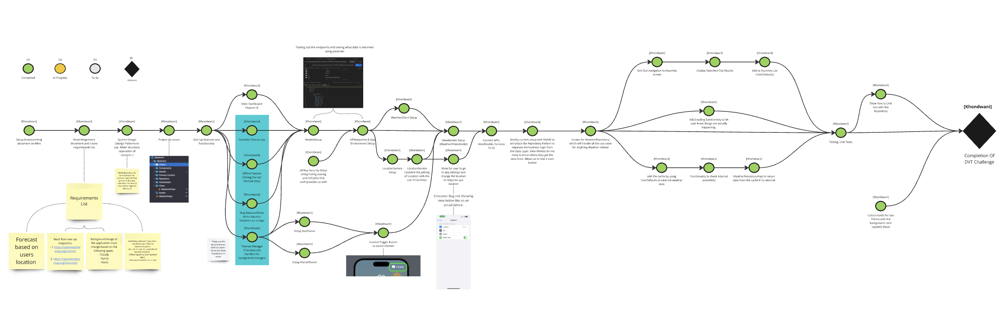

# WeatherIT

# WeatherIT: Brainstorming and Planning

This document outlines the development journey of WeatherIT, detailing the approach, patterns, and methodologies adopted during the project. This process is basically an iterative process up until the final goal is achieved.

## Notes and Recommendations

- **API Key Security:** Place the API key in a `Constants` file under the `Utilities` folder, or use a `Config` file for added security. I opted for the `Config` file approach.
- **Data Storage:** Data is currently stored in `UserDefaults`. However, with the **Repository pattern**, the data layer can be easily swapped out for alternatives like **Core Data** or **Swift Data** by implementing conforming repositories.
- **Testing:** The tests that were written were to show the benefit of using the repository pattern and how easy it is to swap out the type of data layer that is being used. This shows that business Logic does not need to know anything about how the data is being stored or where it is coming from.

## Day 1 & 2: Planning and Structuring

The first two days were dedicated to brainstorming and planning. During this phase, I structured the project around the **MVVM (Model-View-ViewModel) pattern**, paired with the **Repository pattern**. This combination was chosen for its ability to separate concerns and ensure modularity and testability.

## Day 3: UI Layout and Repository Implementation

On the third day, I began building the application's **UI layouts** before adding functionality. This allowed me to focus on creating an intuitive user interface. Simultaneously, I implemented the **Repository pattern**, which highlights its benefits by clearly separating the Data layer from the Business Logic layer.

## Day 4: API Integration and Testing

By the fourth day, I had started integrating **API endpoints**. This involved:

- Testing API clients to ensure data retrieval.
- Connecting the UI to the APIs for a seamless user experience.

## Day 5 & 6: Refining UI and Finalizing Patterns

During the last two days, I focused on:

- Fixing small UI issues to enhance the application's visual appeal and usability.
- Ensuring that the **MVVM** and **Repository** patterns were properly implemented, with all components used correctly and cohesively.

## Final Project Mapping

Below is the final project mapping, summarizing how the application was built and the integration of different components:

